## 🔗 [Error Monitoring and User Insights with Sentry and Google Analytics: A Guide](https://iqbalpa.medium.com/error-monitoring-and-user-insights-with-sentry-and-google-analytics-a-guide-9eef928964e3)

### 🗓️ 번역 날짜: 2024.08.04

### 🧚 번역한 크루: 마스터위(명재위)

---

# Sentry와 Google Analytics로 하는 에러 모니터링과 유저에 대한 통찰력: 가이드

Iqbal Pahlevi A  
Updated On Apr 27, 2024  
Keyword : **Sentry**, **GA**, **Error Monitoring**

수동으로 오류를 확인하는 작업은 매우 어려우며, 중요한 오류를 놓치기 쉽습니다. 또한, 사용자가 애플리케이션과 어떻게 상호작용하는지에 대한 통찰력이 없으면, 무엇이 잘 작동하고 무엇이 개선이 필요한지 알 수 없습니다. 이때 Sentry와 Google Analytics와 같은 강력한 플랫폼 모니터링 도구가 도움이 됩니다. 이 도구들은 오류를 추적하고 사용자 행동에 대한 귀중한 통찰력을 제공하는 포괄적인 솔루션을 제공합니다.

### 플랫폼 모니터링 정의

플랫폼 모니터링에서 **분석(Analytics)** 은 사용자의 플랫폼 상호작용과 관련된 데이터를 수집하고 분석하는 것을 의미합니다. 이는 사용자 행동, 예를 들어 사용자 인구 통계, 사용자 흐름, 전환율에 대한 귀중한 통찰력을 제공합니다. 반면 **오류 모니터링** 은 플랫폼 내에서 발생하는 오류 및 문제를 추적하고 해결하는 것을 포함합니다. 이는 개발자가 오류를 신속하게 식별하고 우선순위를 정하고 수정하여 원활한 사용자 경험을 보장하는 데 도움이 됩니다.

### 플랫폼 모니터링의 이점

Sentry와 Google Analytics와 같은 플랫폼 모니터링 도구를 사용하면 많은 이점을 제공합니다. 이러한 도구는 플랫폼 성능에 대한 실시간 통찰력을 제공하여 개발자가 사용자에게 영향을 미치기 전에 문제를 식별하고 해결할 수 있게 합니다. 또한 사용자 행동을 이해하는 데 도움을 주어 비즈니스가 더 나은 사용자 참여와 유지율을 위해 플랫폼을 최적화할 수 있도록 합니다. 추가적으로, 플랫폼 모니터링 도구는 상세한 오류 보고서, 스택 추적, 상황 정보를 제공하여 개발자가 문제를 신속하게 진단하고 수정할 수 있게 합니다. 전반적으로 이러한 도구는 플랫폼의 안정성, 신뢰성, 사용자 경험을 개선하는 데 중요한 역할을 합니다.

### Sentry

Sentry는 개발자 우선 오류 추적 및 성능 모니터링 플랫폼으로, 개발자가 실제로 중요한 사항을 파악하고 더 빠르게 문제를 해결하며 애플리케이션에 대해 지속적으로 학습할 수 있도록 돕습니다.

### Sentry 사용의 이점

Sentry는 개발자가 실시간으로 오류를 추적, 우선순위 지정 및 해결할 수 있도록 돕는 강력한 오류 모니터링 도구입니다. 이는 상세한 오류 보고서, 스택 추적 및 상황 정보를 제공하여 개발자가 문제를 신속하게 식별하고 수정할 수 있게 하여 플랫폼의 안정성과 신뢰성을 향상시킵니다.

### Next.js 프로젝트에 Sentry 설정하기

프로젝트에 Sentry가 유용하다는 것을 배웠습니다. 이제 Next.js 프로젝트에 Sentry를 설정하는 방법을 배워보겠습니다. 먼저 필요한 패키지를 설치해야 합니다. 터미널에서 다음 명령을 실행하세요.

```
npx @sentry/wizard@latest -i nextjs
```

마법사는 Sentry에 로그인하라는 메시지를 표시할 것입니다. 그런 다음 자동으로 다음 단계를 수행합니다:

- 각 런타임(node, browser, edge)에 대한 기본 `Sentry.init()` 호출이 포함된 구성 파일 생성
- 기본 Sentry 구성이 포함된 Next.js 구성 파일 생성 또는 업데이트
- 소스 맵을 업로드하기 위한 인증 토큰이 포함된 `.sentryclirc` 파일 생성(이 파일은 자동으로 `.gitignore`에 추가됩니다)
- Sentry 설정을 확인하기 위한 예제 페이지를 애플리케이션에 추가

### Sentry 오류 예시

다음은 Sentry가 캡처한 웹 애플리케이션의 오류 예시입니다.

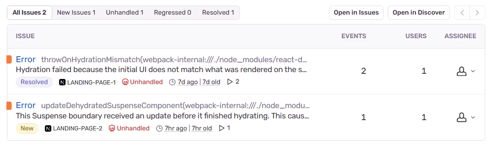

@/Nani next.js project에서의 에러 예시 1

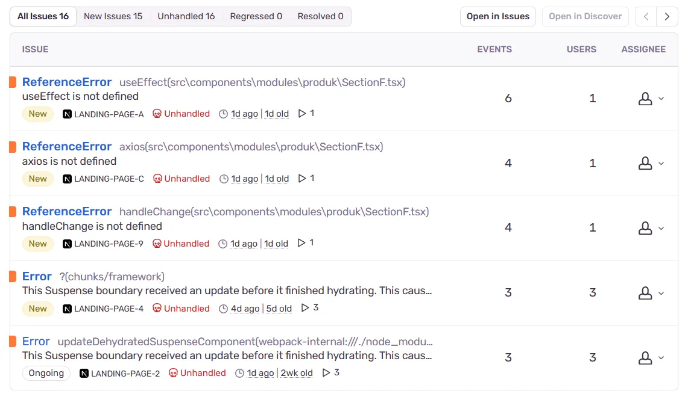

@/Nani next.js project에서의 에러 예시 2

오류를 클릭하면 오류의 세부 정보를 볼 수 있습니다. 여기에는 오류가 발생한 세션 재생과 코드에서 오류가 발생한 위치가 포함됩니다.

<br />

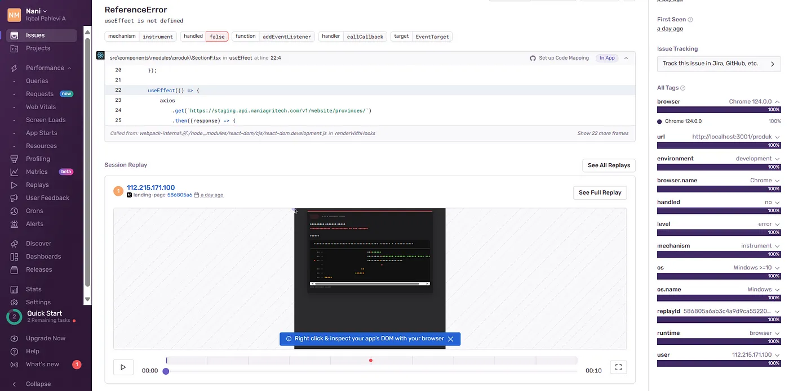
구체적인 에러 예시 1

<br />
<br />

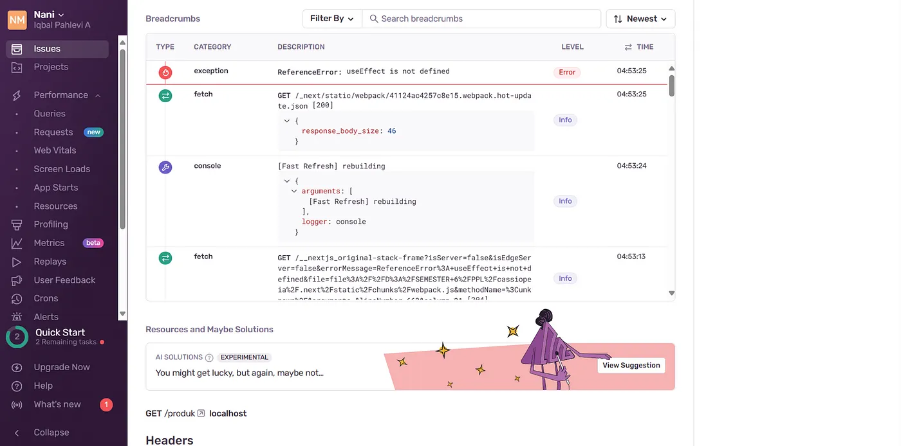
구체적인 에러 예시 2

<br />
<br />

오류가 발생하면 이메일로도 알림을 받을 수 있습니다.

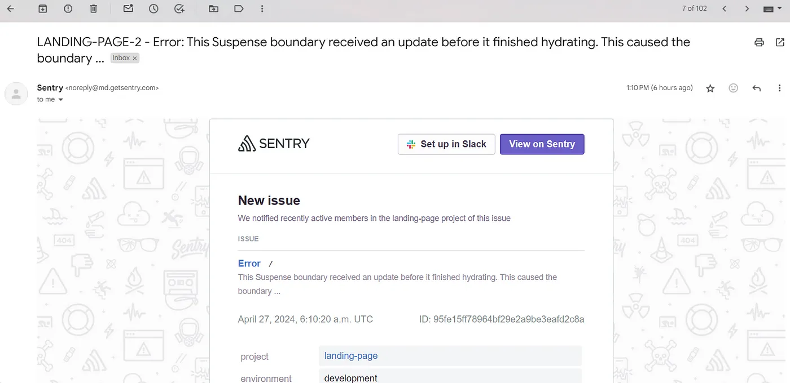
에러를 다루는 이메일

<br />
<br />

Sentry가 캡처한 오류는 상세하며, 코드의 어느 부분을 해결해야 하는지 쉽게 이해할 수 있게 해줍니다. 또한, 오류가 발생한 시간과 위치를 확인할 수 있는 세션 재생을 제공합니다.

### Sentry에서 캡처한 오류 해결

이것은 Sentry가 캡처한 우리 @/Nani 웹사이트에서 발생한 수화 오류(hydration error)입니다.

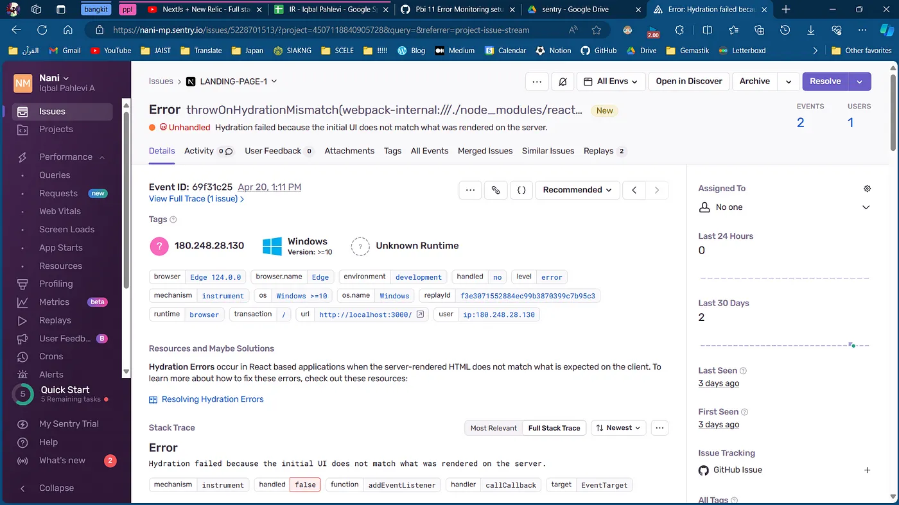
캡쳐한 에러

<br />
<br />

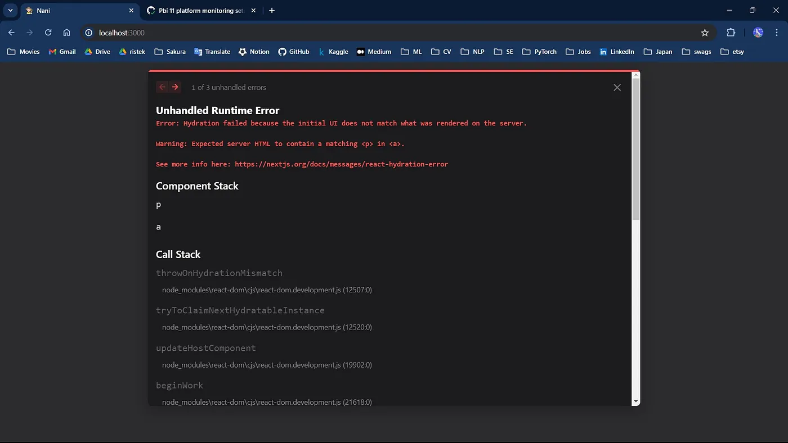
웹사이트에서의 에러

<br />
<br />

오류 원인을 조사한 후 문제를 해결할 수 있었습니다. Sentry 덕분에 오류 정보가 상세하여 문제를 빠르고 쉽게 해결할 수 있었습니다.

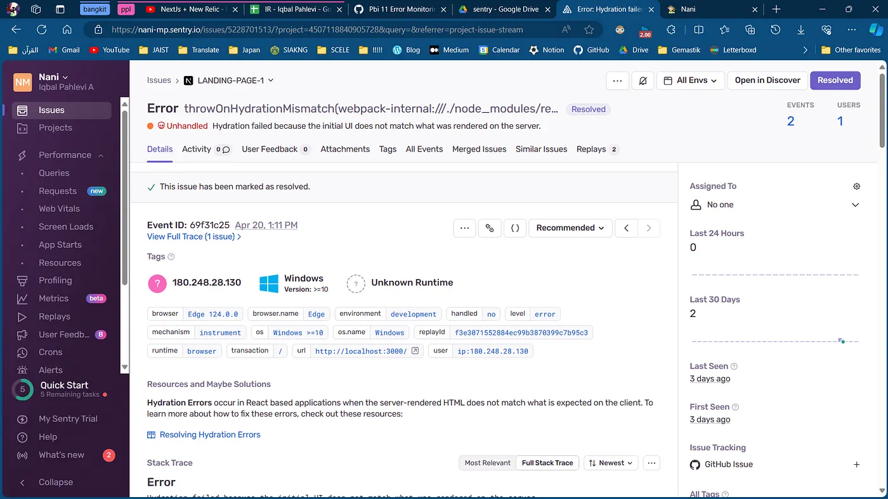
@/Nani 랜딩 페이지 웹사이트에서 해결 표시를 한 후 캡쳐한 에러


에러가 해결된 랜딩페이지

### Google Analytics

Google Analytics는 SEO(search engine optimization) 및 마케팅을 위한 기본 분석 도구와 통계를 제공하는 무료 웹 분석 서비스입니다. 웹사이트 성능과 방문자 정보를 모니터링하고 분석합니다.

### Google Analytics 사용의 이점

1. Google Analytics는 사용자가 플랫폼과 상호 작용하는 방법에 대한 자세한 정보를 제공합니다. 여기에는 방문한 페이지, 머문 시간, 수행한 행동 등이 포함됩니다. 이러한 통찰력은 사용자 선호도를 이해하고 이에 따라 플랫폼을 최적화하는 데 도움이 됩니다.

2. 청중 세분화. Google Analytics를 사용하면 인구 통계, 관심사 및 행동과 같은 다양한 기준에 따라 청중을 세분화할 수 있습니다. 이러한 세분화는 마케팅 전략과 콘텐츠를 다양한 청중 세그먼트에 맞게 조정하여 참여도와 전환율을 높이는 데 도움이 됩니다.

3. 목표 추적: Google Analytics를 사용하면 사용자가 플랫폼에서 수행하는 특정 작업(예: 구매 완료 또는 양식 작성)을 추적하는 목표를 설정할 수 있습니다. 이 기능은 마케팅 캠페인 및 웹사이트 콘텐츠의 효과를 측정하는 데 도움이 됩니다.

4. 사이트 성능 모니터링: Google Analytics에는 페이지 로드 시간 및 이탈률과 같은 웹사이트 성능을 모니터링할 수 있는 기능이 포함되어 있습니다. 이 정보는 사용자 경험에 영향을 미칠 수 있는 문제를 식별하고 해결하는 데 도움이 됩니다.

5. 다른 Google 서비스와 통합: Google Analytics는 Google Ads 및 Google Search Console과 같은 다른 Google 서비스와 원활하게 통합되어 온라인 존재와 마케팅 노력에 대한 포괄적인 뷰를 제공합니다.

6. 데이터 시각화: Google Analytics는 이해하기 쉬운 보고서와 데이터 시각화를 제공하여 주요 지표를 간단히 추적하고 시간 경과에 따른 트렌드를 식별할 수 있게 합니다.

### Next.js 프로젝트에 Google Analytics 설정하기

다음은 프로젝트를 Google Analytics와 통합하는 단계별 가이드입니다.

- [Google Analytics](https://analytics.google.com/)에 로그인하고 계정을 만듭니다.
- 속성을 생성하고 필요한 필드를 작성합니다.
  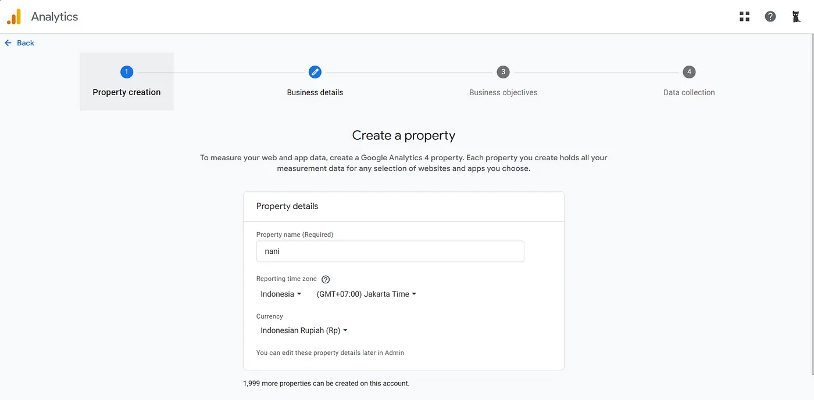

<br />
<br />

- business details를 입력한다.
  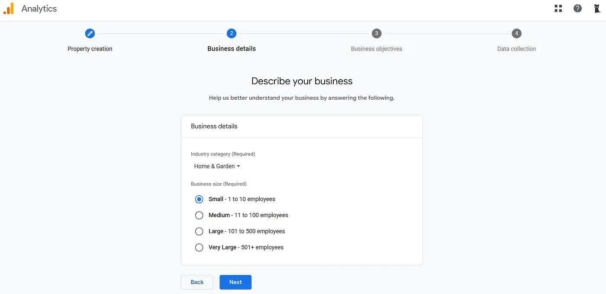

  <br />

- business 목적을 입력한다.
  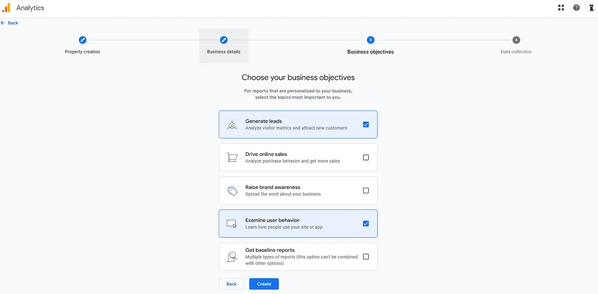

  <br />

- 당신의 애플리케이션 플랫폼을 선택한다.
  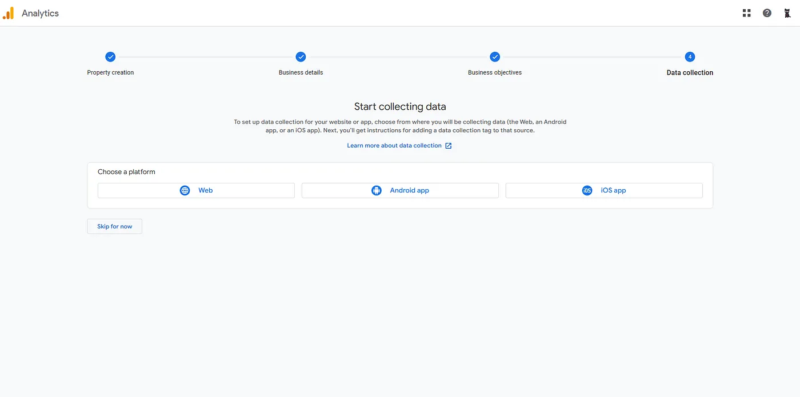

<br />

- 데이터 스트림 설정을 입력한다.
  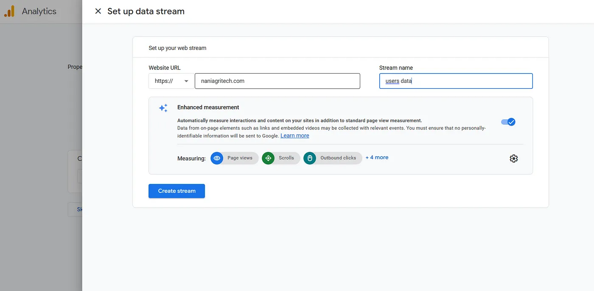

<br />

- STREAM ID와 MEASUREMENT ID를 저장한다.
  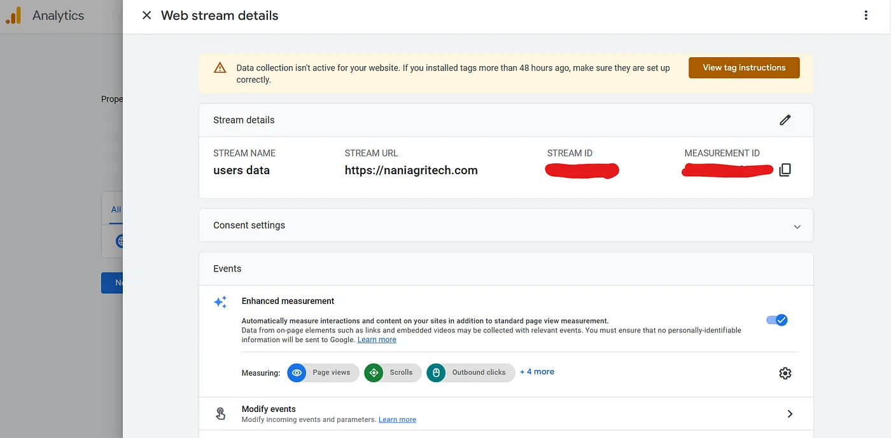

<br />

- HTML의 Head 안에 이 코드를 복사해서 붙여넣는다.
  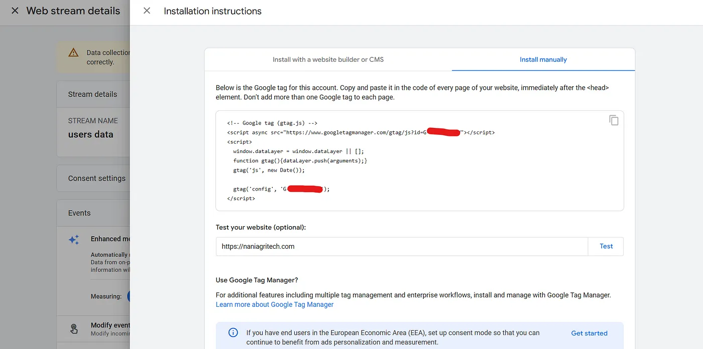

<br />

- 다음과 같이 복사한 코드를 수정한다
  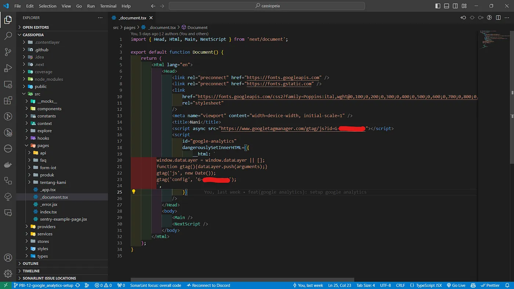

<br />

- Google Analytics 설정을 완료한 후, 코드 내부의 스크립트가 제대로 작동하는지 확인해야 합니다. 콘솔을 열고 `gtag`와 `dataLayer`를 입력합니다.
  

<br />

- 이제 Google Analytics 설정을 모두 마쳤습니다. 여기 대시보드 결과 예시가 있습니다. 이번 주 동안 @/Nani 랜딩 페이지에 방문자가 한 명 있었음을 알 수 있습니다.
  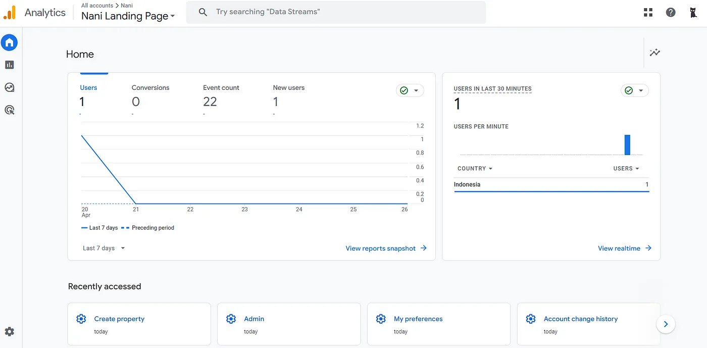

<br />

Sentry와 Google Analytics는 플랫폼 모니터링에 중요한 역할을 하는 강력한 도구입니다. 이러한 도구를 사용함으로써 개발자와 비즈니스는 플랫폼 성능과 사용자 행동에 대한 귀중한 통찰력을 얻어 플랫폼의 안정성, 신뢰성 및 사용자 경험을 향상시킬 수 있습니다.

### @/Nani 프로젝트에서의 이점

우리 @/Nani 프로젝트에서 Sentry는 애플리케이션에서 오류가 발생했을 때 팀에 이를 알리는 중요한 역할을 합니다. 오류가 발생하면 Sentry는 오류에 대한 이메일을 직접 보내고, Sentry 대시보드에서 오류에 대한 자세한 정보를 제공합니다. 이는 매우 유용하여 오류를 빠르게 파악하고 해결할 수 있습니다.

반면, Google Analytics는 사용자 행동에 대한 정보를 제공합니다. 예를 들어, 사용자들이 어떤 국가에서 웹사이트에 접속하는지, 웹사이트에서 평균적으로 머무는 시간, 방문자 수 등을 알 수 있습니다. 이러한 통찰력은 Google Analytics 대시보드 정보를 기반으로 프로젝트의 여러 측면을 향상시키고 증가시킬 수 있는 개선 사항을 결정하는 데 유용합니다.

### Reference

https://docs.sentry.io/platforms/javascript/guides/nextjs/?source=post_page-----9eef928964e3--------------------------------

https://marketingplatform.google.com/about/analytics/?source=post_page-----9eef928964e3--------------------------------

https://www.tagmate.app/blogs/what-is-google-analytics-importance-benefits-and-reasons-to-use-it?source=post_page-----9eef928964e3--------------------------------
