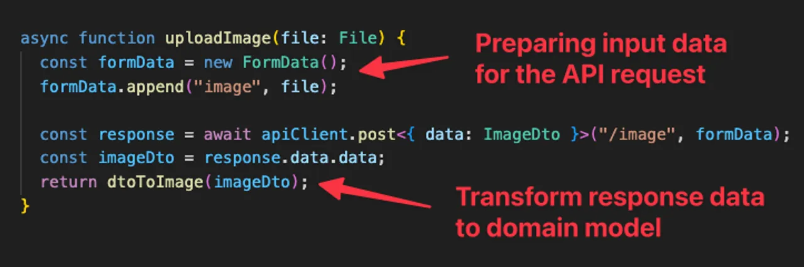

## 🔗 [Path To A Clean(er) React Architecture (Part 3) - Domain Entities & DTOs](https://profy.dev/article/react-architecture-domain-entities-and-dtos)

### 🗓️ 번역 날짜: 2024.07.28

### 🧚 번역한 크루: 마스터위(명재위)

---

# 깔끔한 리액트 설계로의 길(Part 4) - 도메인 엔티티 & DTO

Johannes Kettmann  
Updated On May 24, 2024  
Keyword : **React**, **Domain**, **Refactoring**, **Structure**

리액트의 비의존적인 특성은 양날의 검입니다:

- 한편으로는 선택의 자유를 제공합니다.
- 다른 한편으로는 많은 프로젝트가 커스텀화되고 종종 혼란스러운 아키텍처로 끝나게 됩니다.

이 글은 소프트웨어 아키텍처와 리액트 앱에 대한 시리즈의 네 번째 부분으로, 많은 잘못된 관행이 있는 코드베이스를 단계적으로 리팩토링하는 과정을 다룹니다.

이전 글로는, [we created the initial API layer and extracted fetch functions](https://profy.dev/article/react-architecture-api-layer-and-fetch-functions), 그리고 [added data transformations](https://profy.dev/article/react-architecture-api-layer-and-data-transformations)가 있습니다. 이렇게 해서 우리는 이미 UI 코드에서 API 요청과 관련된 많은 구현 세부 사항을 제거했습니다.

이것은 우리의 UI 코드를 서버로부터 분리하고, 비즈니스 로직을 UI 프레임워크와 독립적으로 만들며, 테스트 가능성을 높이는 데 도움이 되었습니다.

하지만 아직 끝나지 않았습니다.

이 글에서는 도메인 레이어와 DTO를 도입하여 원시 응답 데이터 구조가 UI 코드에 들어가지 않도록 방지합니다. 이는 더 깨끗한 아키텍처로 가는 또 다른 단계입니다.

## 목차

- 나쁜 코드: UI 코드에서의 API 응답 데이터 구조
- 문제점은 무엇인가?
  - API에 의해 정의된 데이터 구조 사용
  - 서버 API와 UI 코드의 강한 결합
- 해결책: 도메인 엔터티와 DTO 도입
  - 도메인 모델
  - DTO와 데이터 변환
- 장점과 단점
  - 장점: 더 깨끗한 아키텍처, 더 높은 복원력, 더 나은 분리
  - 단점: 더 많은 코드, 더 높은 복잡성
  - 규칙과 자동화
- 다음 리팩토링 단계

[유튜브 링크](https://youtu.be/-ojYfV4NSUQ)

## 나쁜 코드: UI 코드에서의 API 응답 데이터 구조

문제가 있는 코드 예시를 살펴보겠습니다. 여기에 API에서 데이터를 가져와 렌더링하는 사용자 프로필 컴포넌트가 있습니다.

```tsx
// src/pages/user-profile.tsx

import UserApi from '@/api/user';
import { User } from '@/types';

interface UserProfileProps {
  handle: string;
}

export function UserProfile({ handle }: UserProfileProps) {
  const [user, setUser] = useState<User>();

  useEffect(() => {
    UserApi.getUser(handle).then((user) => setUser(user));
  }, [handle]);

  return (
    <section>
      
      <h1>@{user.attributes.handle}</h1> // 삭제될 부분
      <p>({user.relationships.followerIds.length} follower)</p> // 삭제될 부분
      <p>{user.attributes.info || "Shush! I'm a ghost."}</p> // 삭제될 부분
    </section>
  );
}
```

> 데이터를 useEffect에서 수동으로 가져오는 대신 react-query와 같은 서버 상태 관리 라이브러리를 사용해야 한다고 생각하신다면: 맞습니다. 하지만 지금은 도구에 구애받지 않고 진행하겠습니다. react-query는 다음 글에서 다룰 예정입니다.

## 문제점은 무엇인가?

UI 코드는 ``user 객체에 대해 불필요하게 중첩된 데이터 구조를 사용합니다. 우리는 자주 다음과 같이 사용합니다.

- `user.attributes.xyz` 또는
- `user.relationships.followerIds`

다음은 TypeScript 인터페이스입니다:

```tsx
// src/types/index.ts

export interface User {
  id: string;
  type: 'user'; // 삭제될 부분
  attributes: {
    // 삭제될 부분
    handle: string;
    avatar: string;
    info?: string;
  };
  relationships: {
    // 삭제될 부분
    followerIds: string[];
  };
}
```

이와 유사한 데이터 구조는 프로젝트 전체, 심지어 컴포넌트 트리 깊은 내부에서도 발견될 수 있습니다.

하지만 이런 중첩의 이유는 무엇일까요?

## API에 의해 정의된 데이터 구조 사용

알고 보니 `user` 데이터는 [이전 글에서 만든 fetch 함수](https://profy.dev/article/react-architecture-api-layer-and-fetch-functions)에서 직접 반환되고 있습니다:

```tsx
// src/api/user.ts

import { User } from '@/types';
import { apiClient } from './client';

async function getUser(handle: string) {
  const response = await apiClient.get<{ data: User }>(`/user/${handle}`);
  const user = response.data.data;
  return user;
}

export default { getUser };
```

네트워크 요청을 검사해 보면 이 데이터 구조가 서버에 의해 정의된 것임을 알 수 있습니다.


서버는 유명하고 API를 만드는데 좋은 방법인 JSON:API standard를 쓰는 것처럼 보입니다. 그러나 프론트엔드에서 우리는 이러한 데이터 구조를 정말 써야할까요?

## 서버 API와 UI 코드의 강한 결합

문제는 API에서 받아온 데이터를 직접 컴포넌트에 전달함으로써 UI와 서버를 강하게 결합시키는 것입니다. 응답 데이터는 (user) 엔터티의 데이터 구조를 반영하지 않고 단순히 데이터 전송 객체(DTO)입니다.

DTO는 소비자의 요구에 맞게 데이터를 모델링할 수 있기 때문에 유용한 패턴입니다. 당신은 `relationships.followerIds`와 같이 원래 데이터베이스 모델에 없는 데이터를 추가적으로 포함할 수 있습니다.

그러나 DTO를 UI 컴포넌트에 노출하면 `user.attributes.xyz`와 같은 필드 접근 또는 객체 디스트럭처링으로 인해 코드베이스가 불필요하게 복잡해집니다. 마치 다음과 같습니다.

```tsx
const { handle, avatar } = user.attributes;
const { followerIds } = user.relationships;
```

즉각적인 복잡성 외에도 서버 API 변경에 따라 전체 UI 코드가 종속됩니다.

백엔드 팀이 JSON:API standard를 폐기하기로 결정했다고 상상해보세요. 갑자기 더 이상 `user.attributes`가 없게 됩니다. 그런데 우리는 이를 UI 코드 전반에 걸쳐 사용하고 있습니다. 따라서 서버 API가 변경되었기 때문에 프론트엔드 코드의 90%를 조정해야 할 수도 있습니다.

## 해결책: 도메인 엔터티와 DTO 도입

### 도메인 모델

우리는 `User`를 단순화하는 새로운 TypeScript 인터페이스를 생성하는 것으로 시작합니다. 이 경우 우리는 API 데이터 구조를 평탄화합니다.

```tsx
// src/domain/index.ts

export interface User {
  id: string;
  handle: string;
  avatar: string;
  info?: string;
  followerIds: string[];
}
```

참고: 여기서는 루트 레벨에 `domain`이라는 새로운 폴더를 도입했습니다. 도메인은 클린 아키텍처 또는 도메인 주도 설계(DDD)에서 사용되는 비즈니스의 핵심을 반영하는 개념입니다.

API가 반환하는 데이터 구조 대신 도메인 모델을 컴포넌트에서 사용해 봅시다.

```tsx
// src/pages/user-profile/user-info.tsx

import UserApi from '@/api/user';
import { User } from '@/domain'; // 추가된 부분

interface UserProfileProps {
  handle: string;
}

export function UserProfile({ handle }: UserProfileProps) {
  const [user, setUser] = useState<User>(); // 추가된 부분

  useEffect(() => {
    UserApi.getUser(handle).then((user) => setUser(user));
  }, [handle]);

  return (
    <section>
      
      <h1>@{user.handle}</h1> // 추가된 부분
      <p>({user.followerIds.length} follower)</p> // 추가된 부분
      <p>{user.info || "Shush! I'm a ghost."}</p> // 추가된 부분
    </section>
  );
}
```

좋습니다. 성가신 `user.attributes`와 `user.relationships`를 제거하여 코드를 약간 단순화했습니다.

더 중요한 것은, UI 코드를 서버로부터 분리하여 외부 변경에 더 강하게 만들었다는 점입니다.

좋은 개선이지만, 아직 끝난 것은 아닙니다. `UserApi.getUser(handle)`은 여전히 API에서 오는 중첩된 데이터 구조를 반환합니다.

### DTO와 데이터 변환

현재 API 레이어의 fetch 함수는 단순히 API 데이터를 반환합니다.

```tsx
// src/api/user.ts

import { User } from '@/types';
import { apiClient } from './client';

async function getUser(handle: string) {
  const response = await apiClient.get<{ data: User }>(`/user/${handle}`);
  const user = response.data.data; // 삭제될 부분
  return user; // 삭제될 부분
}

export default { getUser };
```

컴포넌트가 도메인 모델을 기대하고 있으므로, 여기에도 약간의 변경이 필요합니다.

먼저 API 레이어에서 데이터 전송 객체(DTO)의 모델을 정의합니다.

```tsx
// src/api/user/dto.ts

export interface UserDto {
  id: string;
  type: 'user';
  attributes: {
    handle: string;
    avatar: string;
    info?: string;
  };
  relationships: {
    followerIds: string[];
  };
}
```

이제부터 이 데이터 구조는 API 레이어 내부에서만 사용되고, 애플리케이션 코드의 나머지 부분에 노출되지 않습니다.

따라서 API 응답 데이터를 도메인 모델로 변환해야 합니다. 간단한 함수가 이 작업을 수행할 수 있습니다.

```tsx
// src/api/user/transform.ts

import { User } from '@/domain';
import { UserDto } from './dto';

export function dtoToUser(dto: UserDto): User {
  return {
    id: dto.id,
    avatar: dto.attributes.avatar,
    handle: dto.attributes.handle,
    info: dto.attributes.info,
    followerIds: dto.relationships.followerIds,
  };
}
```

다음으로, 이 함수를 응답 데이터에 적용한 후 컴포넌트에 반환합니다.

```tsx
// src/api/user/api.ts

import { apiClient } from '../client';
import { UserDto } from './dto';
import { dtoToUser } from './transform';

async function getUser(handle: string) {
  const response = await apiClient.get<{ data: UserDto }>(`/user/${handle}`);
  const userDto = response.data.data;
  return dtoToUser(userDto); // 추가된 부분
}

export default { getUser };
```

## 장점과 단점

### 장점: 더 깨끗한 아키텍처, 더 높은 복원력, 더 나은 분리

건축적(architectural) 관점에서 새로운 코드는 훨씬 더 깔끔해졌습니다:

- API에서 오는 데이터 구조는 API 레이어에서만 DTO로 사용됩니다.
- UI 코드는 서버의 REST API로부터 효과적으로 분리되었습니다.
- 대부분의 애플리케이션 코드는 공유 도메인 모델을 사용합니다.

이 방식으로 코드는 더 강력해지고 관심사가 분리됩니다.

### 단점: 더 많은 코드, 더 높은 복잡성

그러나 이러한 분리에는 보일러플레이트 코드가 추가되는 비용이 따릅니다.

각 엔터티에 대해 도메인 모델, 최소 하나의 DTO 및 하나의 변환 함수가 필요합니다. 우리는 더 많은 코드와 더 많은 파일을 코드 베이스에 갖게 됩니다.

또한 복잡성의 레벨이 증가합니다. 적어도 코드베이스와 이러한 아키텍쳐에 익숙하지 않은 개발자에게 말이죠.

### 컨벤션과 자동화

일단 아키텍처에 익숙해지면 규칙과 일관성 덕분에 모든 것이 명확해집니다.

- 변환(transformer) 파일은 데이터 변환(transformer) 함수를 포함합니다.
- API 파일은 요청을 처리합니다.
- 도메인 레이어는 애플리케이션 전체 데이터 구조를 포함합니다.

보일러플레이트 문제는 있지만, 기술 스택에 따라 일부 파일 생성을 자동화할 수도 있습니다.

예를 들어:

- 풀스택 TypeScript 애플리케이션에서는 서버와 클라이언트에서 공유 도메인 모델을 사용할 수 있습니다. 예를 들어 모노레포나 별도의 npm 패키지로 이동하여 사용합니다.
- OpenAPI로 잘 문서화된 REST API가 있다면 도메인 모델이나 DTO를 자동으로 생성할 수 있습니다.
- API 응답의 데이터 구조에 따라 DTO와 데이터 변환이 필요 없을 수도 있습니다. REST API가 변경되면 나중에 도입할 수 있습니다.

## 다음 리팩토링 단계

API fetch 함수인 `getUser`에 점점 더 많은 책임이 추가되고 있다는 것을 눈치채셨을 것입니다. 이 함수는 API 요청을 보내는 것뿐만 아니라 응답 데이터를 변환하는 역할도 맡고 있습니다.

```tsx
// src/api/user/api.ts

async function getUser(handle: string) {
  const response = await apiClient.get<{ data: UserDto }>(`/user/${handle}`);
  const userDto = response.data.data;
  return dtoToUser(userDto);
}

export default { getUser };
```

여기 코드베이스의 또 다른 예시입니다 :



이 시리즈의 다음 글에서는 리포지토리 패턴을 사용하여 이러한 책임 중 일부를 fetch 함수에서 분리할 것입니다.

<script src="https://gitlab.com/-/snippets/3732667.js"></script>
